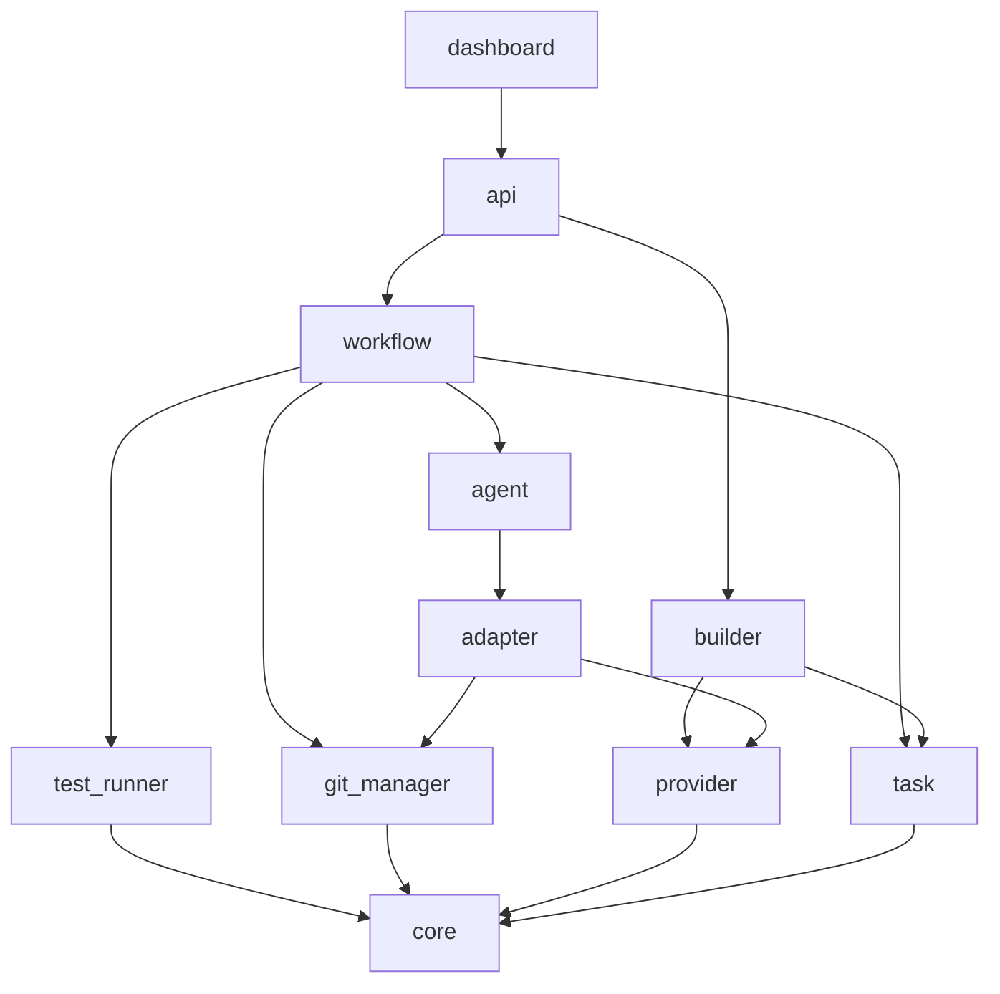
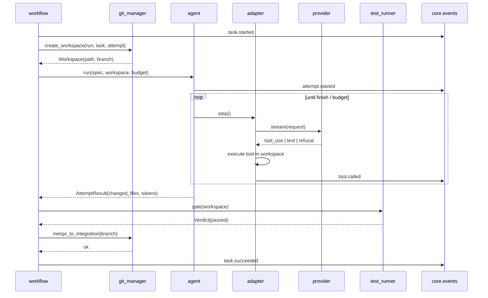

# 020 — Architecture

**Status:** Approved for M0
**Last updated:** 2026-07-31

Companion to `ORCHESTRATOR_PRO_SPEC.md`. The spec states *what* each component
must do; this document explains *why the structure is shaped this way* and how
data moves through it.

---

## 1. Layering

Six layers. **Dependencies point downward only.** A module imports from its own
layer and below, never above. This is enforced by an automated import test
(NFR-5.3), not by convention.

```
┌─────────────────────────────────────────────────────────────┐
│ L5  dashboard/                                              │
├─────────────────────────────────────────────────────────────┤
│ L4  api/                                                    │
├─────────────────────────────────────────────────────────────┤
│ L3  builder/          workflow/                             │
├─────────────────────────────────────────────────────────────┤
│ L2  agent/            task/                                 │
├─────────────────────────────────────────────────────────────┤
│ L1  adapter/    git_manager/    test_runner/                │
├─────────────────────────────────────────────────────────────┤
│ L0  provider/         core/                                 │
└─────────────────────────────────────────────────────────────┘
```

Why this order, where it is not obvious:

- **`task/` sits above `git_manager/`** even though tasks conceptually precede
  Git. The task model is pure domain — it knows nothing about worktrees. The
  *workflow* engine (L3) is what pairs a task with a workspace. Keeping `task/`
  ignorant of Git is what makes the scheduler a pure function.
- **`agent/` and `task/` are the same layer and do not import each other.** An
  agent receives a `TaskSpec` — a narrow value object — not a `Task`. The
  workflow engine translates. This keeps the agent runtime testable without a
  graph and the scheduler testable without an agent.
- **`provider/` is L0, beside `core/`.** It is a leaf: it knows about models and
  nothing about tasks, runs, or Git. That is what allows a fake provider to
  substitute cleanly in every test above it.

### 1.1 Import chokepoints

| Rule | Enforced how |
|---|---|
| Only `provider/` imports `anthropic`. | Import-layering test. |
| Only `adapter/claude_code.py` shells out to the `claude` CLI. | Import-layering test + review. |
| Only `git_manager/` shells out to `git`. | Import-layering test + review. |
| Only `core/storage.py` and `core/events.py` touch SQLAlchemy — **stale**: the schema is six flat tables on stdlib `sqlite3`; SQLAlchemy was decided against in M10 (`TASKS.md` M1 "Carried forward as debt"). No module touches it. |

**Correction: `adapter/agent_sdk.py` does not exist and was never built.** No
Claude Agent SDK integration shipped. What shipped instead (M18) is
`adapter/claude_code.py`, which drives the **Claude Code CLI** as an external
process (`subprocess`, not the `claude_agent_sdk` Python package) — a
different integration surface than either the Anthropic Messages API SDK or
the Claude Agent SDK library. All three remain distinct and must not be
conflated: the API SDK is a client for the Messages API
(`orchestrator/provider/claude.py`); the Agent SDK is Claude Code packaged as
a Python library, unused anywhere in this codebase; the CLI is a separate
executable, invoked over `subprocess` from `adapter/claude_code.py` and
`provider/claude_cli.py`.

---

## 2. Component responsibilities



| Component | Owns | Deliberately does not own |
|---|---|---|
| `core` | Config, logging, errors, IDs, storage, event log | Any domain concept |
| `provider` | Model calls, token accounting, refusals, caching | Tasks, files, Git |
| `adapter` | The agent's tool surface and its loop | Scheduling, budgets |
| `agent` | Prompt assembly, budget enforcement, transcripts | The DAG |
| `task` | Domain model, state machine, scheduler | I/O of any kind |
| `git_manager` | Worktrees, branches, merges, the destructive-op guard | When to create one |
| `test_runner` | Gate execution and parsing | What to do with a verdict |
| `workflow` | The execution loop, concurrency, retries, resume | How an agent works |
| `builder` | Project analysis, incremental build plans, the build cache | Deciding *when* a build is wanted |
| `api` | HTTP/WS surface, auth, serialization | Business logic |
| `dashboard` | Presentation | Anything else |
| `planner` | YAML workflow schema + LLM plans, one validated compile path for both | Executing what it plans |
| `auth` | Users, roles, API keys, sessions, the audit trail | What a credential may do — that's role enforcement in `api/security.py` |
| `ops` | Hardening, rate limiting, backup, retention, benchmarks, migration | Business logic |

The mermaid diagram above predates `planner`, `auth`, and `ops` and was not
extended when they landed (M9, M13, M12 respectively) — this table is current;
the diagram is not, and redrawing it is tracked as ordinary drift, not
re-audited here line by line.

---

## 3. Execution flow

### 3.1 A single successful task



Two properties fall out of this shape:

- The agent never decides whether its own work is acceptable. It reports what it
  did; the workflow engine applies the gate. An agent cannot mark itself green.
- Every state transition writes an event *before* the side effect it describes is
  externally visible, so a crash mid-step is recoverable (§6).

**`create_workspace` branches from the run's integration branch, not from
`HEAD`.** The diagram doesn't show this distinction because it looks the same
at this level of detail, but it is what makes `depends_on` mean anything: a
later step's attempt branches *after* an earlier step's merge, so it can
actually see the earlier step's committed work, and a retry after a conflict
is rebased by construction rather than repeating the same collision. Also
missing from the diagram above (simplified for readability, per §4 rule 1):
merges to the integration branch are serialized behind a lock, so a step's
`merge_to_integration` call above may wait even after its gate has already
passed.

### 3.2 Failure and retry with feedback

```mermaid
sequenceDiagram
    participant WF as workflow
    participant TR as test_runner
    participant AG as agent

    WF->>TR: gate(workspace)
    TR-->>WF: Verdict(failed, cases=[...], output="...")
    WF->>WF: attempts_remaining? 
    alt yes
        WF->>WF: build feedback from verdict
        Note over WF: retain failed worktree for inspection
        WF->>AG: run(spec + feedback, NEW workspace, budget)
    else no
        WF->>WF: mark failed; dependents → blocked
    end
```

The failed worktree is retained, not cleaned. The retry gets a *fresh* workspace
plus a textual account of what failed — not the broken tree. Handing an agent a
half-fixed working tree tends to produce patches on top of confusion.

---

## 4. Concurrency

One `asyncio` event loop. Everything blocking — subprocess, Git, file I/O beyond
a few kilobytes — goes through `asyncio.to_thread`. A blocking call on the loop
is a bug, not a performance note.

```
                    ┌──────────────────────────┐
                    │   workflow engine loop   │
                    └───────────┬──────────────┘
                                │ scheduler.next_ready(graph, state)
                                ▼
                    ┌──────────────────────────┐
                    │  global semaphore (N=4)  │
                    └───────────┬──────────────┘
              ┌─────────────────┼─────────────────┐
              ▼                 ▼                 ▼
        ┌──────────┐      ┌──────────┐      ┌──────────┐
        │ attempt  │      │ attempt  │      │ attempt  │
        │ worktree │      │ worktree │      │ worktree │
        └──────────┘      └──────────┘      └──────────┘
              │                 │                 │
              └────────── serialized ─────────────┘
                    integration-branch merges
```

Three concurrency rules:

1. **Attempts run in parallel; merges do not.** Merges to the integration branch
   are serialized behind a single lock. Concurrent merges are how you produce a
   conflicted index nobody asked for.
2. **The semaphore is acquired before workspace creation and released after
   merge or failure**, so the cap bounds real resource use — worktrees on disk —
   not just in-flight model calls.
3. **The scheduler is called synchronously between dispatches.** It is pure and
   fast (NFR-4.1), so there is no benefit to making it async and a real cost in
   reasoning about it.

---

## 5. State and the event log

Two representations, one source of truth.

```
      writes (single transaction)
            │
  ┌─────────┴──────────┐
  ▼                    ▼
events (append-only)   materialized tables
  │                    (runs, tasks, attempts, ...)
  │                            ▲
  └──── replay on resume ──────┘
```

`events` is authoritative. The other tables are a materialized view kept in the
same transaction, purely so the API can answer "what is the state of run X"
without replaying history on every request.

This is what makes FR-5.5 (resume) tractable: recovery is *replay*, not
guesswork. If the two ever disagree, the event log wins and the tables are
rebuilt.

**Transcripts do not live in SQLite.** A long attempt's message history is
megabytes; SQLite is the wrong home for it. Transcripts are JSONL under
`~/.orchestratorpro/transcripts/<run>/<task>/<attempt>.jsonl` and the database
stores a path. This also means a transcript can be read, grepped, and diffed with
ordinary tools.

### 5.1 Crash points and recovery

| Crash point | On-disk state | Recovery |
|---|---|---|
| After `task.started`, before workspace | Event only | Recreate workspace, retry attempt |
| After workspace, before agent finishes | Worktree, partial transcript | Discard attempt, new workspace, retry |
| After agent, before gate | Worktree with commits | Re-run the gate — it is idempotent |
| After gate pass, before merge | Worktree, gate result | Re-attempt merge |
| After merge, before `task.succeeded` | Merged branch | Detect merge already present, emit the event |

The last row is why merges are detected rather than assumed: recovery must be
idempotent, and "did I already merge this?" is answerable from Git itself.

---

## 6. The provider boundary

Everything vendor-specific stops here.

```
        agent / adapter
              │  CompletionRequest  (vendor-neutral)
              ▼
        ┌───────────────┐
        │  Provider     │  protocol
        └───────┬───────┘
                │
        ┌───────▼───────────────────────────────┐
        │ AnthropicProvider  (the reference impl.)│
        │  · adaptive thinking, effort levels    │
        │  · streaming above 16k max_tokens      │
        │  · refusal → typed result              │
        │  · cache breakpoint placement          │
        │  · token → USD attribution             │
        └───────┬───────────────────────────────┘
                ▼
          anthropic SDK
```

**Three more real implementations exist beside `AnthropicProvider`** —
`HermesProvider`, `OpenAICompatProvider` (Ollama / vLLM / LM Studio / Open
WebUI), and `ClaudeCliProvider` (M18, subscription-billed, no API key) — each
behind the same `ModelPort`. Diagram kept to one for readability; all four are
real, not one plus a fake.

The abstraction is deliberately **thin**. It exposes what OrchestratorPro
actually needs and nothing more, because a provider abstraction that models
every vendor's every feature ends up modelling none of them well. **Open
question Q1 (spec §13) is resolved**, not open: a second provider was genuinely
required, and the differences among the four surfaced exactly where this
section predicted — the self-hosted and CLI-backed providers decline effort
levels, prompt caching, exact token counting, and refusal semantics rather
than approximating them. The interface's real job — testability, a fake
provider with scripted responses making every layer above it testable
offline — held regardless of how many real implementations arrived.

Model-parameter constraints (no sampling parameters, no `budget_tokens`, effort
levels, the thinking/effort pairing rule, refusal handling) are documented in
spec §4.1 and `CLAUDE.md`. They live in the provider and nowhere else, so a
change in the vendor API touches one module.

---

## 7. The trust boundary

```
┌──────────────── trusted ────────────────┐   ┌──── untrusted ────┐
│ workflow · task · git_manager · core    │   │  model output     │
│ test_runner · provider                  │   │  agent tool calls │
└─────────────────┬───────────────────────┘   └────────┬──────────┘
                  │                                    │
                  └────────── adapter/tools ───────────┘
                        validate · confine · allowlist
```

Every tool call crosses this boundary, and the tool implementations are the
validation point:

- Paths are canonicalized and containment-checked before any I/O. Rejected:
  `..` traversal, symlink escape, absolute paths outside the root.
- `run_command` uses an executable **allowlist** and rejects shell
  metacharacters. A blocklist cannot be made complete.
- Credentials never enter a prompt or transcript.

This is not a statement about agent intent. It is that a harness which assumes
well-formed output breaks the first time output is malformed — and at fleet
scale, that is every run.

---

## 8. Testing seams

The architecture exists partly to make these substitutions cheap:

| Seam | Substitute | Enables |
|---|---|---|
| `Provider` | Fake with scripted responses | Every layer above tested offline, deterministically |
| `Adapter` | Fake emitting fixed tool sequences | Agent runtime tested without a model |
| `GateRunner` | Fake returning a chosen verdict | Workflow retry logic tested without a test suite |
| Scheduler purity | — | Property tests over thousands of random DAGs |
| `git_manager` | **No substitute — real Git** | Mocking Git would test our mock, not Git |

The last row is the deliberate exception. Worktree semantics, merge conflicts,
and index state are exactly the things a mock would get wrong in the same way the
implementation does.

---

## 9. Deferred decisions

Recorded here so they are not accidentally settled by implementation drift.

| Decision | Current position | Resolved at |
|---|---|---|
| Second provider implementation | **Resolved: four real implementations.** Not deferred — see §6 above | Q1, M2 |
| Recursive task decomposition | **Resolved: one level only**, and the planner says so. A step that turns out too large is a prompt problem, not a decomposition problem | Q2, M9 |
| Multi-repository runs | **Resolved: one repo per run**, permanently, not provisionally | Q3, M7 |
| Dashboard multi-user auth | **Resolved: multi-user, single-operator default.** Three ordered roles and a full identity store (M13); with no account bootstrapped the API serves as an operator | Q4, M13 |
| Worktree/transcript retention | **Still open.** Runs, backups, and sessions have retention policies; worktrees and transcripts do not | Q5, unresolved |
| Storage engine | SQLite; chosen for crash-safety and zero-ops, not throughput | If write volume ever exceeds ~100/s |
| Dashboard build tooling | None — plain ES modules | If the UI outgrows hand-written modules |

Each is an assumption the current design leans on. If one changes, the affected
component is re-scoped rather than patched around.
